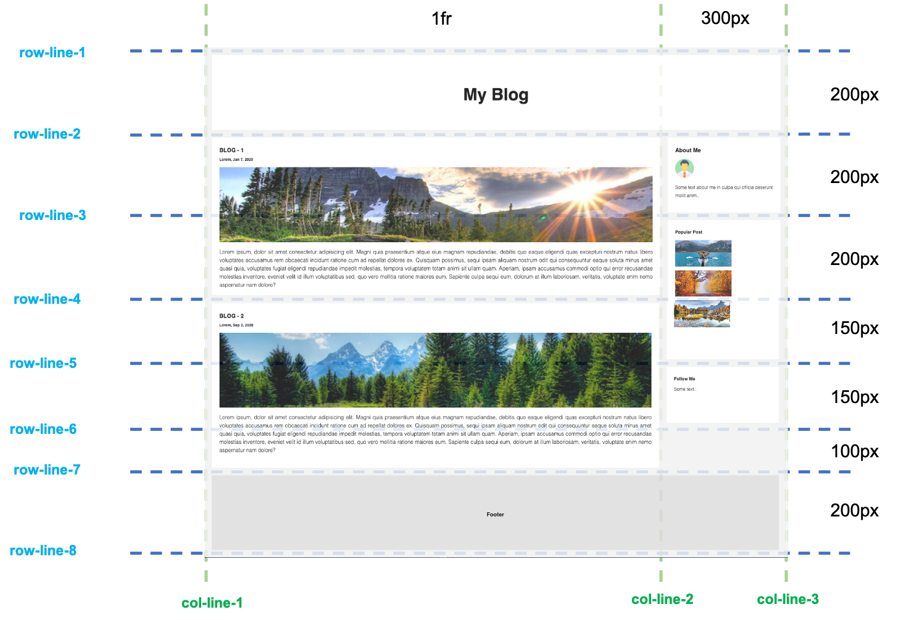

# Grid Blogger

Using your CSS Grid skills, recreate the blog page in the reference image below -

## Layout design

- You can find all the images in the included **images directory**

- As a bonus, make the site fully responsive

## The online version

In order to see live version, just [click...!](https://hsnakk.github.io/UIB_Layout_Grid_Exercise-2/)
