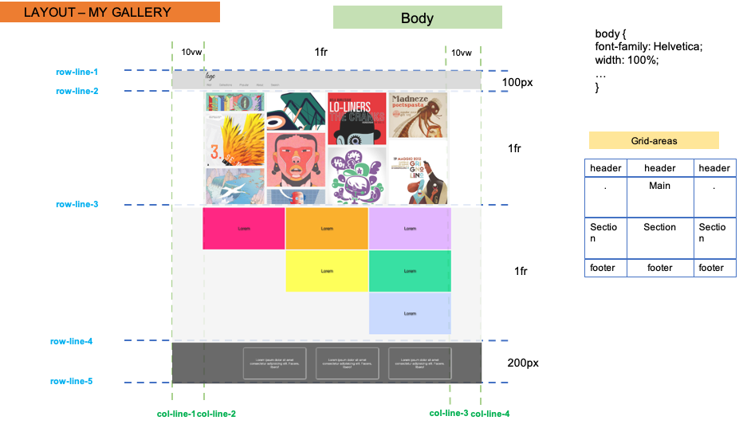
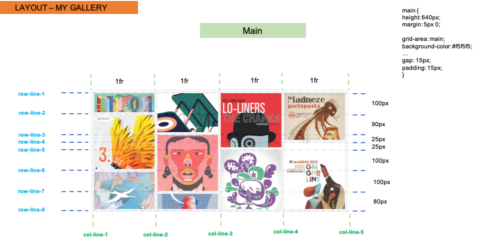
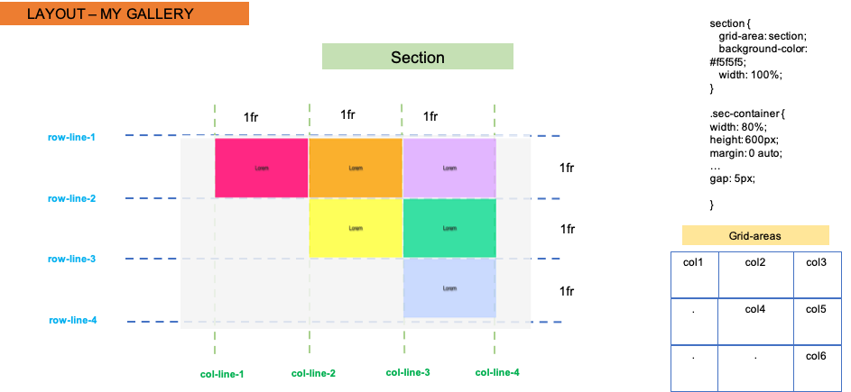

# Grid Document Layout

Using CSS Grid (and Flexbox if you like) recreate the reference image shown below -

## Layout designs

### Make use of the images and information below to come to the best solution -

- The whole document

- Main section

- Second part

- Footer

## The online version

In order to see live version, just [click...!](https://hsnakk.github.io/UIB_Layout_Grid_Exercise-1/)

#### Good luck and have fun!
