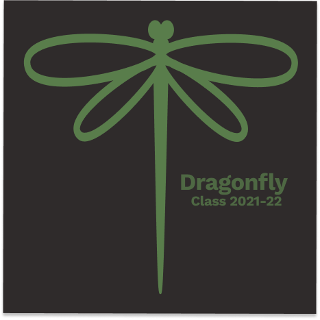

# Web Developers Class Guide

# Dragonfly 21-22 - Class Guide
## UIB questions / todos

- [x] make different paragraphs of different colors
- [ ] how to change the colors for links inside the list, but not other links
- [ ] aligning ul list to the center (advanced)

## Participants

Add your name, GitHub username with link, and role in the table below

|name|GitHub|role|
|:---|:---|:---|
|Carlo Trimarchi|[carlotrimarchi](https://github.com/carlotrimarchi)|teacher|
|Gabri Ber||student|
|Mohammad Olfatee||student|
|Emad Soltan|[emsoltan](https://github.com/emsoltan)| student|
|Patryk Lisowski|[viest1](https://github.com/viest1/)|student|
|David Rabinovich|[kodamok](https://github.com/kodamok)|student|
|Muhanad Osman|[MuhanadOsman](https://github.com/MuhandOsman)| student|
|Arta Nrecaj Dushi|[ArtaNdrecajDushi](https://github.com/ArtaNdrecajDushi)| student|
|Andin Priscilla|[andinPriscilla](https://github.com/andinPriscilla)|student|
|Hiwa Taheri|[hiwataheri](https://github.com/hiwataheri)|student|
|Omar Al-Ezzi||astronaut|
|Ufuk Yildiz|[ufukyildiz84](https://github.com/ufukyildiz84)|student|

## Course overview

| module|dates|
|:---|:---
|BDL - Basic Digital Literacy| 1 April - 21 April|
|UIB - User Interface Basics| 22 April - 30 June|
|PB - Programming Basics| 1 July - 15 September|
|SPA - Single Page Applications| 16 September - 23 November|
|Backend| 24 November - 9 February |
|Final Project| 10 February - 31 March |
