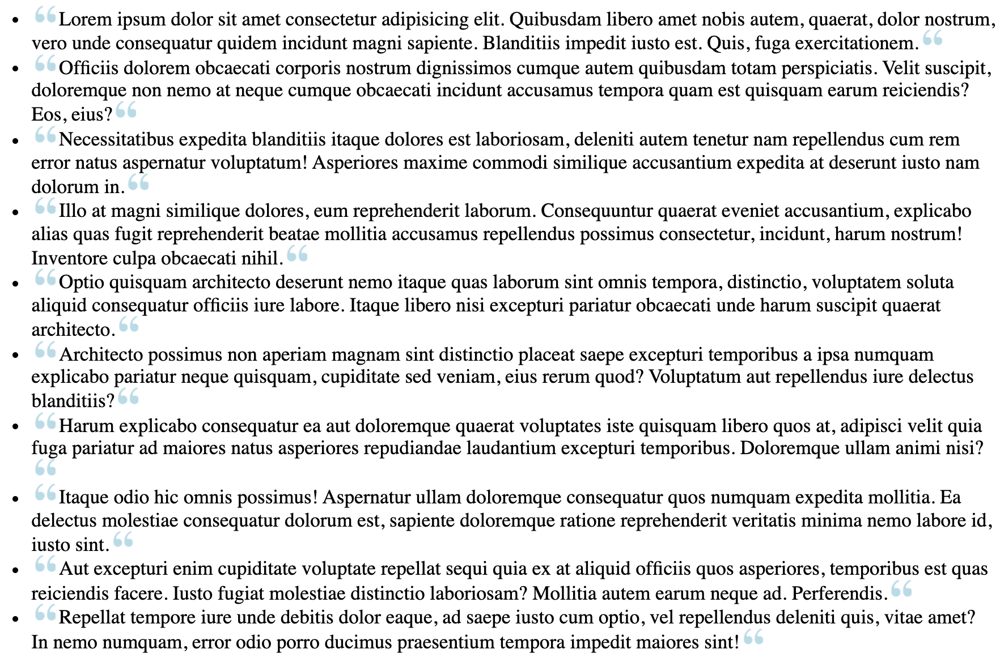
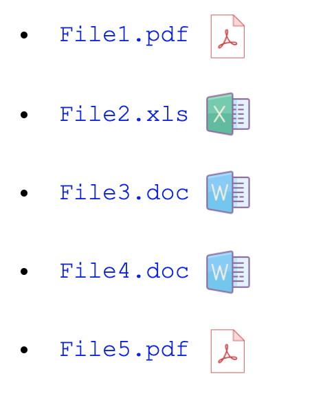
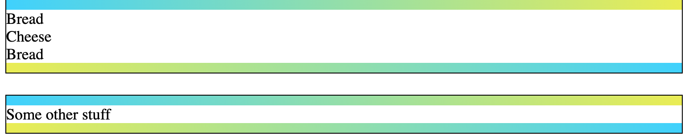

# Pseudo Element Style

### Part 1

- Generate an unordered list of lorem ipsum quotes using emmet

- Apply pseudo elements to place a quote icon before and after each quote

- Use this link for the source image - https://s3-us-west-2.amazonaws.com/s.cdpn.io/161359/quotes.png

#### Mockup

### Part 2

Using pseudo elements, replicate the mockup shown below.

- After each file entry we want to display the corresponding file type as an icon

- Use attribute selectors to select files by type and then use a pseudo element to place the matching file type icon after each list entry

#### Icons

> **PDF** - https://img.icons8.com/officel/64/000000/pdf.png
>
> **XLS** - https://img.icons8.com/dusk/64/000000/ms-excel.png
>
> **DOC** - https://img.icons8.com/dusk/64/000000/ms-word.png

### Part 3

Using pseudo elements `::before` and `::after`, create the 'sandwich div' shown below.

- These borders are not REAL borders - make the pseudo elements block level elements with width and height and give them a linear gradient as background

- The top and bottom gradients should alternate in direction