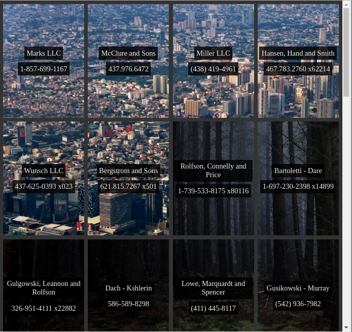

# Grid and flexbox, living in harmony!

**Rules**

- Don't edit the HTML --> CSS changes only
- Don't edit the first 20 lines of CSS

**Instructions**

1. Make the container into a grid element
2. Make the grid have four columns, evenly spaced
3. Add 0.5em of space between the grid items
4. Create a flexbox out of all of the grid items using a vertical layout
5. Center all of the flexbox contents vertically and horizontally
6. Make the text color of the grid items #eee and give them a semi-transparent background
7. Add a hover to the grid items, so that they seem like something happens when you click on them
8. Add other styling until your page matches the example screenshot below

## Notices

- BG1 is from https://unsplash.com/photos/HM7vrtxeFDs
- BG2 is from https://unsplash.com/photos/1L71sPT5XKc
